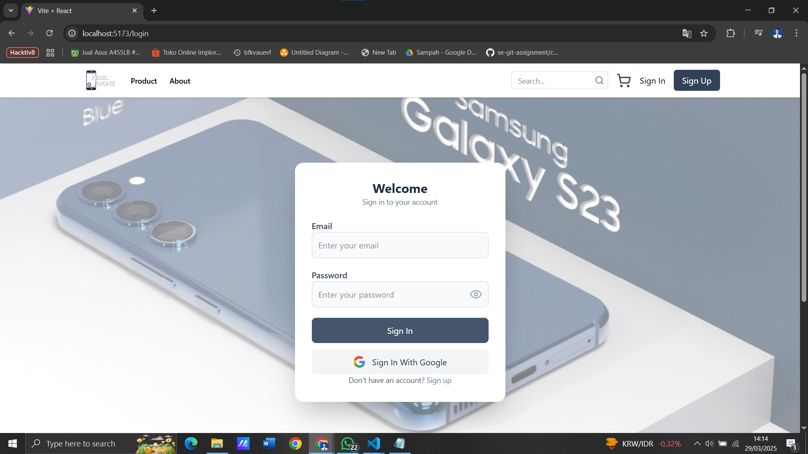
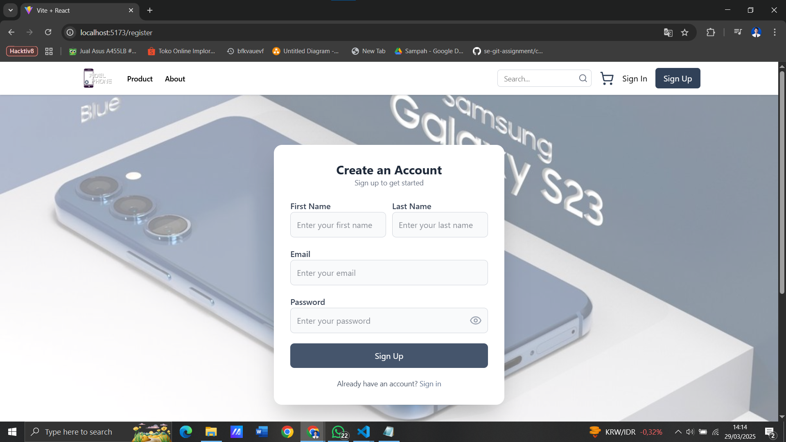
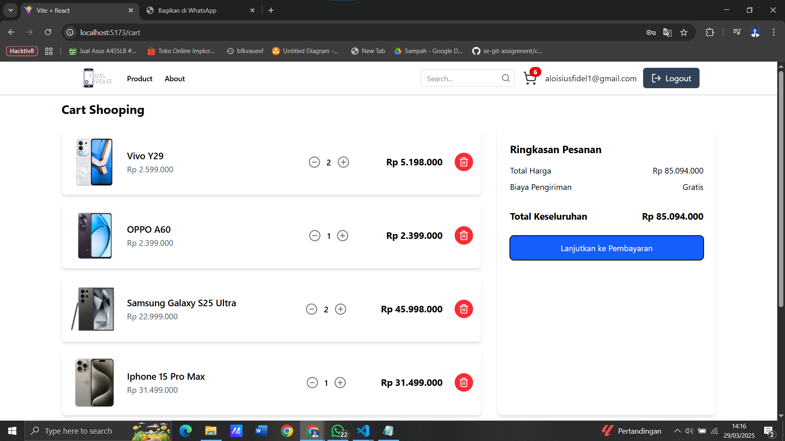

# Fidel Phone E-Commerce  

## Description  
Fidel Phone E-Commerce is a web-based platform for buying and selling mobile phones and accessories. This application provides an easy and interactive shopping experience with various features to enhance usability and functionality.  

## Features  
- **Admin CRUD**: Manage products, categories, and orders from the admin dashboard.  
- **Client CRUD**: Users can add, update, and remove products from their cart.  
- **Product Filtering & Sorting**: Filter products by category, price range, and sort by popularity or price.  
- **Product Search**: Quickly search for products by name or keyword.  
- **Product Pagination**: Display products with pagination for better navigation.  
- **Add to Cart**: Users can add products to their cart before proceeding to checkout.  
- **Direct WhatsApp Payment**: Seamless order processing with direct payment via WhatsApp.  
- **Authentication & Authorization**: Secure user login and authentication system.  
- **Google Login**: Users can log in using their Google account for a seamless experience.  

## Tech Stack  
- **React.js**: Frontend framework for building interactive user interfaces.  
- **Tailwind CSS**: Utility-first CSS framework for styling.  
- **Firebase**: Backend services for authentication and database management.  
- **Redux**: State management for handling global application state.  
- **Cloudinary**: Cloud-based image management for uploading and storing product images.

## UI Screenshots
Here are some UI previews of Fidel Phone E-Commerce:  

